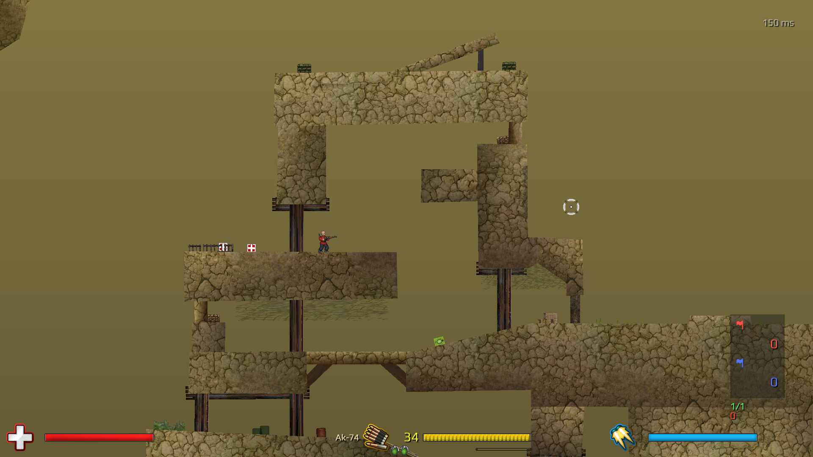

# soldat-odin

An Odin port of Soldat on raylib and ENet: a server-authoritative game, and the tooling
to make things for it in the same binary. A map editor is here; a .po and .poa editor
and a mod maker are to come.



The netcode is the Quake 3 model on a fixed timestep.

- **Server-authoritative snapshots.** The server runs the one true world and decides
  everything that matters to anyone else: whether a bullet hit, health, deaths,
  respawns, pickups, flags, scores. What it sends each client is a delta against the
  newest snapshot that client has acknowledged: the entities that changed, and of those
  the 4-byte words that changed, under a mask. The receiver's own soldier is in
  every one; the others come every sv_update_others ticks.
- **Client-side prediction.** A client sends numbered commands and nothing else. Each
  tick it rebuilds its world from the newest snapshot and replays the commands the
  server has not run yet (client/game/predict.odin), so its own soldier answers the
  keys at once; where the server disagrees, the difference is drawn as an offset that
  blends out over about a tenth of a second.
- **Interpolation delay.** The others are drawn between the two snapshots either side
  of a render tick a few ticks behind the newest (net_interp, three by default), never
  guessed forward, so nothing about them is ever taken back.

The fixed timestep is the departure. Quake 3 moves its world by whatever slice of time
a frame happened to take; here it moves only in whole ticks of the same length on every
machine, and a command is the keys held for exactly one of them. That is what lets a
client's replay land on the server's answer rather than near it.

Two more come from Soldat rather than from Quake. A bullet crosses the wire once, at
birth, and flies on every machine from there, so the blood, the sparks and the sounds
are local and at once. And the server rewinds: a shot is judged against the soldiers as
its shooter saw them, each command naming the tick its client was showing, as far back
as sv_maxrewind allows and no further.

Each piece of that, as it is actually built, is in [docs/netcode.md](docs/netcode.md);
the packages, and how the client and the server each spend a tick, are in
[docs/architecture.md](docs/architecture.md).

## Building and running

Odin is most of what you need: raylib comes vendored with the compiler for every
platform it runs on, and so does ENet on Windows. Elsewhere ENet is the system's.

- **Windows.** [Odin](https://odin-lang.org/docs/install/), and nothing else.
- **Linux.** Odin, ENet (`libenet-dev` on Debian and Ubuntu, `enet-devel` on Fedora,
  `enet` on Arch) and the X11 headers (`libx11-dev`), which the vendored raylib links
  against along with dl and pthread.
- **macOS.** Odin, the Xcode command line tools (`xcode-select --install`) for the
  Cocoa, OpenGL and IOKit frameworks raylib links, and ENet (`brew install enet`).

One entry point, build.odin, in Odin so it works the same everywhere:

```
odin run build.odin -file -- check          type-check every package (with the vet flags)
odin run build.odin -file -- build          compile the client and the server into build/
odin run build.odin -file -- test           run the package tests
odin run build.odin -file -- dev            build, then a server with a client joined
odin run build.odin -file -- dev -sv_bots 2 the same with two bots in it
odin run build.odin -file -- server         build, then the server alone
odin run build.odin -file -- editor         build, then the map editor, no server
```

The editor opens on the maps in assets/; `-- -cl_map ctf_Ash` opens one straight away.

The server links no raylib. The maps and the art are opensoldat's own, in assets/ here.

Every setting is a cvar (shared/cvar): config.cfg is read at startup and the command
line has the last word, and `client -cvars` or `server -cvars` prints them all with what
they are set to. One config.cfg serves both, each taking what is its own; it is read
from cl_base or sv_base, which is the working directory unless it is named, so a
distribution that unpacks assets/ beside the executable finds it. The dev and server
commands here pass the checkout's assets/ for you. The build script keeps -release and
-no-build for itself and passes every other -name value to the server, so its settings
work here; anything after a second -- goes to the client:

```
odin run build.odin -file -- dev -- -cl_window           in a window, not borderless fullscreen
odin run build.odin -file -- dev -- -r_wire -r_zoom 0.3  the polygons as lines, the view closer
odin run build.odin -file -- dev -- -dbg_hold right,fire -dbg_aim 200,0 -dbg_screenshot out.png
odin run build.odin -file -- dev -- -dbg_menu esc -dbg_screenshot esc.png
odin run build.odin -file -- dev -sv_bots 2 -- -net_ping 120 -net_jitter 30 -net_loss 5
odin run build.odin -file -- dev -sv_bots 4 -sv_map ctf_Ash,Arena -sv_timelimit 2 -sv_scorelimit 3
```

The third is a scripted run for checks without a person at the screen: it holds the
buttons, aims at an offset from the soldier, writes the frame after two seconds and
quits with a line of counts (dbg_seconds N for a longer run). What is only for looking
at the game is under r_ and dbg_, in client/debug.odin and nowhere else. The fourth puts
a simulated bad line between that client and the server: a round trip of 120 ms, up to
30 ms more at random, one packet in twenty lost (shared/net/fakelink.odin; a lost
reliable packet is resent a round trip and a half later, and those behind it wait). The
last plays ctf_Ash and Arena in turn, a round each, a round ending at two minutes or
three captures (the defaults are fifteen and ten); sv_bots_difficulty sets how well the
bots aim (300 stupid, 100 normal, 10 impossible) and sv_bots_chat whether they talk, and
sv_base plays another set of maps and art.

Keys: A and D run, W jumps, S crouches, X goes prone, Space jets, Q changes weapon,
R reloads, F throws the gun, K is suicide, the mouse aims and fires. F1 shows the
scoreboard and F3 the minimap. Tab opens and closes the weapons menu; in it a click or
1 to 0 picks a primary, a click a secondary. M opens the team menu. T says something to
everyone and Y to your team; Enter sends it, Esc lets it go. Esc opens the game's menu:
1 leaves, 2 and 3 open the windows for voting in a map or voting a player out, 4 picks
a team. While a vote is running, F12 agrees with it and F11 has none of it.

## Tooling

The editors live in the game's own binary and draw with the game's own renderer, so
what you see while making a thing is what the game will show.

- **The map editor** is here now: `client -cl_editor [-cl_map NAME]`, in client/editor/.
  It owns the .pms file as it really is, every field down to the padding bytes
  (shared/pms), and everything on screen is derived from it one way: the map is written
  to bytes, the game's loader reads those bytes, and the renderer draws what comes out.
  A field the editor would lose shows up as a change on screen rather than quietly on
  disk. The game's loader is the right one to draw with and the wrong one to save from,
  which is why it sits downstream of the codec and never the other way round.
- **A .po and .poa editor**, for the gostek's objects and the animations that move
  them, is planned: the same round trip through a codec the game reads.
- **A mod maker**, for putting art, sounds and weapon settings together as a mod, is
  planned.

## What works

- The map loads (polygons, sectors, colliders, spawn points, props, scenery names),
  collides (the soldier against the polygons in the original's order, with the
  special poly types as events) and draws (two static meshes for the background and
  terrain polys, the sky gradient anchored in world space, the scenery in its three
  layers with the colour key).
- The soldier moves as the original does: the legs and body animation state machines
  from Sprites.pas and Control.pas, jets, rolls, backflips, prone, crouch-slides,
  the slope friction by stance, jet fuel regeneration.
- The gostek draws from the animation pose: every body part pinned between its two
  skeleton points, mirrored or flipped for facing left, team colours, the held and
  slung weapons, the jet feet, the muzzle flash.
- Weapons: Soldat 1.7.1's stats built in, firing with the spread, bink and movement
  inaccuracy, the recoil animation by weapon, the shotgun's pellets, the Eagles' pair,
  the minigun's and LAW's wind-up, semi-automatics, reloads (clip out and in, shell
  by shell), changing, throwing the gun, the punch and the rifle butt, the grenade
  wind-up and throw. Bullets ricochet, bounce, stick, split and explode against the
  map and the colliders, hit soldiers by their pose (a Hit event, never a wound in
  the sim), pierce, lose damage with distance, and knock things.
- Bullet art and sparks: every projectile as TBullet.Render draws it (the round
  stretched along its speed with its trail, tumbling M79 rounds, spinning cluster
  grenades, arrows, the flamer's burn-out frames, the thrown knife), and the particle
  bursts from Sparks.pas for wall hits, ricochets, blood, explosions, cluster splits,
  spawns and the special polygons.
- The camera chases the soldier and leads toward the cursor as the original does,
  per frame at the frame's dt. Soldiers and bullets are drawn between their last two
  ticks from a render-only previous position, so nothing steps at 60 Hz.
- Things: the flags and kits spawn from the map's spawn points as Verlet skeletons
  (flag.po, kit.po, karabin.po at each gun's length) with the original's per-thing
  damping and gravity, collide with the map (a flag's pole stops dead and its cloth
  bounces, kits and guns slide to rest), settle, and are drawn as cloth and boxes
  stretched over their points, with the flag's handle and in-base glow. Guns thrown
  or dropped by a death lie where they land with their ammo, resist pickup for half a
  second, and are gone after twenty. A gun let go of by a death drops where the
  soldier fell rather than carrying the body's speed as the original has it, which
  sent a jetting soldier's gun sailing away. Whoever stands by a free thing and may
  have it takes it, in the things' own update, where the world has authority.
- Online. The model at the top, built out piece by piece in
  [docs/netcode.md](docs/netcode.md).
- Corpses: a dead soldier's skeleton runs on as a ragdoll from its pose at the moment
  of death, falls with the original's damping and gravity, collides with the map and
  comes to rest; a death far below zero health tears the body apart, a head or leg
  shot past the chop threshold takes that part off; blasts shove corpses, and a corpse
  shot enough comes further apart. Nothing about a corpse crosses the wire: it is
  derived from the soldier's state (where it died, how fast, how far below zero its
  health went and where it was last hit), so the server and every client run the same
  one from the same word, and a bullet meets a body on the server as it does on the
  screen that fired it — where the body lies this tick, since no history is kept of it.
  A body landing thuds, and cracks its bones on a hard landing, both quieting as it
  settles; where it was cut it bleeds, thinning after two seconds and stopping after
  five. A suicide (K) shows one.
- Sounds: Sound.pas on raylib's audio. Every play is placed by distance and direction
  from our soldier; gunfire and blasts past half the range play their distant
  samples; a blast beside us rings the ears. Shots, hits, ricochets, blasts, deaths
  by how bad they were, pickups, the flags and kits landing come from the events;
  jets, the chainsaw, wind-ups, reloads, weapon changes, melee, the grenade pin,
  footsteps, jumps, rolls, crouching and landings from each soldier's state against
  the tick before; bullets whistle and whiz past us. Four reserved voices per soldier
  keep the loops alive and let a wind-up be cut. Corpse thuds, shell casings and the
  antics are not in yet.
- Bots: OpenSoldat's own, AI.pas ported whole (shared/sim/bot.odin, bot_path.odin,
  bot_fight.odin). The server plays them itself, with no client and no connection: each
  tick a bot fills in the keys a player would hold and the sim steps its soldier on them
  like anyone else's. With nobody in sight it walks the waypoints the map author laid,
  waiting where they say to wait and fetching a flag or a kit it sees; with someone in
  sight it fights by how far off they are on each axis, leading its aim by their speed
  and the drop of the bullet, throwing grenades, charging with a knife, backing off from
  a flame god, and running the flag home rather than fighting for it. Whoever wounds it
  is hunted wherever they go. Its name, its look, its favourite weapon, how well it
  aims, how much it camps and what it says come from the original's personality files
  (assets/bots/*.bot). sv_bots adds them, sv_bots_difficulty scales their aim, and
  sv_bots_chat lets them talk.
- Tests without a person: the client's cl_headless has no window and is played by the
  bots' brain, through a real connection, and with dbg_seconds it quits with a summary:
  the hits it saw itself give and take, how far behind it showed the world, and what
  went over the wire. The server's leave line says how many of those hits it ruled,
  and how far back that client's shots were judged: the two agreeing is the measure
  of the netcode. A simulated bad line (net_ping, net_jitter, net_loss) sits on any client.
  The test command runs the wire format's tests.
- The menus Escape opens (GameMenus.pas): the escape menu, and from it the map and
  kick windows that call a vote. A vote runs for twenty seconds and passes as soon as
  sv_votepercent of the players who can vote have agreed (the bots neither vote nor
  count); the map window browses the server's own list, and a kick asks for a reason
  before it goes. The box in the corner says what is being voted on, who called it and
  why (server/vote.odin, client/hud/menus.odin).
- The minimap (F3): the map's polygons drawn into a texture when it loads, with a dot
  for each of my team, for me, for a flag carrier and for the flags at home, and a box
  around what the screen shows.
- The names of my team mates while they are off the screen, held against the edge they
  went out by and fading with the distance, and the count of the spawn protection over
  my own soldier.
- The scoreboard (the original's frags menu), toggled with F1 and shown at every round's
  end with who won and the countdown to the next: the map and the time left, and each
  team's players under its caption and total, the best first, with kills, flags,
  deaths and ping (the server's measure of each player's lag, a byte each in every
  Update; none for the bots, which the Roster marks). The weapons menu closes for a
  round's end and opens again when the next round begins.
- The HUD (client/hud, from InterfaceGraphics.pas with its default layout, on the
  original's 640 by 480 screen scaled to the window): the health, vest, ammo or
  reload, fire interval and jet bars with their icons, the grenades, the ammo count
  and the weapon's name; the kill feed down the right, the killer with its tally and
  the weapon's icon over the victim, in their teams' colours, scrolling off after
  four seconds; "You killed", "Killed by" and the respawn countdown; the flags and
  the teams' scores, my place and kills, my lag; the crosshair. The wounds on a
  soldier (gostek-gfx/ranny) show below 90 health, stronger the lower it goes.
- Teams: the team menu (the original's, on M, since there is no Esc menu yet) asks the
  server for the other team, which it grants when the teams stay even (Soldat's balance)
  and refuses otherwise, telling you so. A move lets go of the flag, places the soldier
  on the new team's spawn and tells everyone; the weapons menu opens for the new life.
- Chat: T to everyone, Y to your team. The server relays team chat to the team alone,
  keeps a client to a line every half second, and says who joins, leaves and changes
  team. Lines show in the top left for five seconds (the original's console), and a
  short one over its speaker's head for as long as it takes to read.
- The weapons menu (the original's limbo menu): it opens when I die and when I join,
  stays up over the spawn that follows, and goes away when my soldier first moves; Tab
  opens it by hand. What is picked in a life I have not moved in is in my hands at
  once, on my own screen and on the server's word alike; after that it is for the next
  spawn. Names come from the server's roster; the bots have names.

## Licence

The code is MIT, the same licence OpenSoldat uses and much of this is a port of.
[license.md](license.md) keeps Transhuman Design's copyright beside this port's, as the
MIT terms require of a derivative.

The contents of `assets/` are under different terms. The art, maps, animations,
sounds and bot personalities come from
[opensoldat/base](https://github.com/opensoldat/base) under **CC BY 4.0**, and
`assets/play-regular.ttf` is under the **SIL Open Font License 1.1**. Both licence
texts and the attribution they ask for are in
[assets/NOTICE.md](assets/NOTICE.md), [assets/LICENSE.txt](assets/LICENSE.txt)
and [assets/OFL.txt](assets/OFL.txt).
